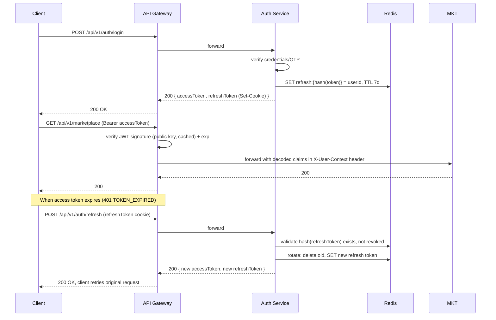

# Jeevan108 — API Design Document (ADD)

**Product:** Jeevan108 — AI-Powered Healthcare Staffing & Emergency Assistance Platform
**Document Type:** API Design Document
**Version:** 1.0
**Companion Documents:** Jeevan108 PRD v2.0, Jeevan108 SRD v2.0

---

## 1. Conventions Used in This Document

- **Base URL (public, via Gateway):** `https://api.jeevan108.com/api/v1`
- **Base URL (internal, service-to-service):** `http://<service-name>:<port>/internal`
- All request/response bodies are `application/json` unless otherwise noted (file uploads use `multipart/form-data` for the initial signed-URL request only; actual file bytes go directly to object storage).
- All timestamps are ISO 8601 UTC (`2026-07-27T09:30:00Z`).
- All monetary values are in **paise** (integer, ₹1 = 100 paise) to avoid floating-point errors; a `currency` field (`"INR"`) accompanies every amount.
- All IDs are UUID v4 strings unless noted.
- Every authenticated request requires header: `Authorization: Bearer <accessToken>`.
- Every mutating request (`POST`/`PUT`/`PATCH`/`DELETE`) that creates or modifies a booking/payment must include header: `Idempotency-Key: <client-generated-uuid>`.
- Standard success envelope:
```json
{
  "data": { },
  "meta": { "requestId": "req_8f3a...", "timestamp": "2026-07-27T09:30:00Z" },
  "error": null
}
```
- Standard error envelope (see §9 for full catalog):
```json
{
  "data": null,
  "meta": { "requestId": "req_8f3a...", "timestamp": "2026-07-27T09:30:00Z" },
  "error": {
    "code": "BOOKING_CONFLICT",
    "message": "The selected professional is already booked for this time range.",
    "details": { "conflictingBookingId": "bk_9182..." }
  }
}
```

---

## 2. Versioning Strategy

| Aspect | Approach |
|---|---|
| URL versioning | All public routes prefixed `/api/v1/...`. This is the primary versioning mechanism. |
| Breaking changes | Require a new version prefix (`/api/v2/...`); old version kept live for a minimum deprecation window (default 6 months) with a `Deprecation` and `Sunset` HTTP header on every response from the deprecated version. |
| Non-breaking changes | Additive fields, new optional query params, new endpoints — shipped directly into the current version, no bump required. |
| Internal APIs | Versioned independently at `/internal/v1/...` since only services (not external clients) consume them; can evolve faster with coordinated service deploys. |
| Event schema versioning | Every event payload includes an `eventVersion` field (e.g., `"1.0"`). Consumers must tolerate unknown additive fields (forward-compatible) and check `eventVersion` before applying breaking assumptions. |
| Deprecation signaling | Response header `X-API-Deprecated: true` + `Sunset: <date>` once a version enters its deprecation window; documented in the API changelog. |
| Client contract | Mobile/web clients pin to a version explicitly; Gateway rejects unversioned requests (`/api/marketplace` without `/v1/`) with `400 MISSING_API_VERSION`. |

---

## 3. JWT Authentication Flow

### 3.1 Token structure

**Access Token (JWT, RS256, 15 min TTL)**
```json
{
  "sub": "usr_3f8a1c2e",
  "role": "patient",
  "roles": ["patient"],
  "permissions": ["booking:create", "ai:query", "profile:edit_own"],
  "iat": 1753602600,
  "exp": 1753603500,
  "iss": "jeevan108-auth-service",
  "aud": "jeevan108-api"
}
```

**Refresh Token:** opaque random string (not a JWT), stored hashed server-side in Redis with TTL 7 days, delivered to client as an `httpOnly`, `Secure`, `SameSite=Strict` cookie (web) or secure storage (mobile web fallback: encrypted local storage).

### 3.2 Flow diagram



### 3.3 Gateway → downstream service context propagation

The Gateway does **not** forward the raw JWT to internal services by default. Instead, after verifying the JWT, it injects a signed internal header:

```
X-User-Context: <base64-encoded JSON, HMAC-signed with a shared internal secret>
```
Decoded payload:
```json
{ "userId": "usr_3f8a1c2e", "role": "patient", "permissions": ["booking:create","ai:query"] }
```
Each downstream service verifies the HMAC signature on `X-User-Context` (cheap, no JWKS lookup) and trusts the claims for fine-grained authorization checks. This avoids every service needing the JWT public key and centralizes token verification at the Gateway.

---

## 4. Authentication Service — REST Endpoints

### 4.1 `POST /api/v1/auth/signup`
Creates a new user account (Patient or Healthcare Professional).

**Request**
```json
{
  "role": "patient",
  "fullName": "Anjali Sharma",
  "email": "anjali@example.com",
  "phone": "+919876543210",
  "password": "SecurePass123"
}
```
**Validation rules**
- `role`: enum `["patient", "professional"]`, required.
- `fullName`: string, 2–100 chars, required.
- `email`: valid RFC 5322 format, unique, required.
- `phone`: E.164 format, Indian mobile (`+91` + 10 digits), unique, required.
- `password`: min 8 chars, ≥1 letter + ≥1 number, required.

**Response `201 Created`**
```json
{
  "data": {
    "userId": "usr_3f8a1c2e",
    "role": "patient",
    "status": "pending_verification",
    "otpSentTo": "+919876543210"
  },
  "error": null
}
```

### 4.2 `POST /api/v1/auth/verify-otp`
```json
// request
{ "phone": "+919876543210", "otp": "482913", "purpose": "signup" }
```
`purpose` enum: `["signup", "login", "password_reset"]`.
**Response `200 OK`** → returns tokens (see §4.3 response shape) if `purpose` in `["signup","login"]`.

### 4.3 `POST /api/v1/auth/login`
```json
// request (password-based)
{ "identifier": "anjali@example.com", "password": "SecurePass123" }
// or OTP-based
{ "identifier": "+919876543210", "requestOtp": true }
```
**Response `200 OK`**
```json
{
  "data": {
    "accessToken": "eyJhbGciOi...",
    "expiresIn": 900,
    "user": { "id": "usr_3f8a1c2e", "role": "patient", "fullName": "Anjali Sharma" }
  },
  "error": null
}
```
(`refreshToken` set via `Set-Cookie`, not in body.)

### 4.4 `POST /api/v1/auth/refresh`
No body required (refresh token read from cookie). **Response** same shape as §4.3.

### 4.5 `POST /api/v1/auth/logout`
Revokes the current refresh token. `POST /api/v1/auth/logout-all` revokes all sessions for the user.
**Response `204 No Content`**

### 4.6 `POST /api/v1/auth/password/forgot`
```json
{ "identifier": "anjali@example.com" }
```
**Response `202 Accepted`** — always returns 202 regardless of whether the identifier exists (prevents user enumeration).

### 4.7 `POST /api/v1/auth/password/reset`
```json
{ "resetToken": "rst_9a82...", "newPassword": "NewSecurePass456" }
```
**Response `200 OK`**

---

## 5. User Service — REST Endpoints

### 5.1 `GET /api/v1/users/me`
**Response `200 OK`**
```json
{
  "data": {
    "id": "usr_3f8a1c2e",
    "fullName": "Anjali Sharma",
    "email": "anjali@example.com",
    "phone": "+919876543210",
    "role": "patient",
    "addresses": [
      { "id": "addr_1", "label": "Home", "line1": "12 MG Road", "city": "Bengaluru", "pincode": "560001", "isDefault": true }
    ],
    "createdAt": "2026-01-04T10:00:00Z"
  },
  "error": null
}
```

### 5.2 `PATCH /api/v1/users/me`
```json
{ "fullName": "Anjali S. Sharma", "email": "anjali.new@example.com" }
```
**Validation:** same rules as signup for each field if present; partial update allowed.
**Response `200 OK`** → updated user object.

### 5.3 `POST /api/v1/users/me/addresses`
```json
{ "label": "Father's Home", "line1": "45 Residency Road", "city": "Bengaluru", "pincode": "560025", "isDefault": false }
```
**Validation:** `pincode` 6-digit numeric, required. `label`, `line1`, `city` required strings.
**Response `201 Created`**

### 5.4 `DELETE /api/v1/users/me/addresses/{addressId}`
**Response `204 No Content`**

### 5.5 `GET /api/v1/users/me/payment-methods` / `POST .../payment-methods` / `DELETE .../payment-methods/{id}`
Standard CRUD for stored payment method **references** only (tokenized via payment gateway — no raw card data ever stored/transmitted through Jeevan108 services).

---

## 6. Application & Verification Service — REST Endpoints

### 6.1 `POST /api/v1/applications`
Creates a draft application (called after professional signup, or to resume a draft).
**Response `201 Created`**
```json
{ "data": { "applicationId": "app_772b", "status": "draft" }, "error": null }
```

### 6.2 `PATCH /api/v1/applications/{applicationId}`
Incrementally saves each step (autosave). Body varies by step; example — Step 2 (role selection):
```json
{
  "step": "role_selection",
  "roleType": "nurse",
  "roleSpecificFields": { "nursingLicenseNumber": "KA-NUR-2024-88213" }
}
```
**Validation rules**
- `roleType`: enum `["nurse", "caretaker", "compounder"]`, required.
- `nursingLicenseNumber` (nurse only): required if `roleType=nurse`, alphanumeric 6–20 chars.
- Step `personal_details`: `dob` must yield age ≥ 18 (`ELIGIBILITY_AGE_FAILED` if not).

### 6.3 `POST /api/v1/applications/{applicationId}/documents/upload-url`
Requests a pre-signed upload URL.
```json
// request
{ "documentType": "certification", "fileName": "nursing_cert.pdf", "mimeType": "application/pdf", "sizeBytes": 2481290 }
```
**Validation:** `mimeType` in `["application/pdf","image/jpeg","image/png"]`; `sizeBytes` ≤ 5,242,880 (5MB) → else `FILE_TOO_LARGE`.
**Response `200 OK`**
```json
{
  "data": {
    "documentId": "doc_ab12",
    "uploadUrl": "https://storage.jeevan108.com/...&signature=...",
    "expiresIn": 300
  },
  "error": null
}
```

### 6.4 `POST /api/v1/applications/{applicationId}/documents/{documentId}/confirm`
Client calls after successful direct upload to storage. Triggers async virus scan.
**Response `202 Accepted`** — `{ "status": "pending_scan" }`

### 6.5 `POST /api/v1/applications/{applicationId}/submit`
Validates all required steps/documents are complete; transitions `draft → submitted`.
**Response `200 OK`** or `422` with `error.code = "APPLICATION_INCOMPLETE"` and `details.missingFields[]`.

### 6.6 `GET /api/v1/applications/{applicationId}`
Returns full application + status history. Accessible to the owning professional or Staff/Admin.

### 6.7 `GET /api/v1/applications` *(Staff/Admin only)*
Query params: `status`, `roleType`, `submittedAfter`, `page`, `limit`, `sort`.
**Response `200 OK`** — paginated list with `meta.totalCount`.

### 6.8 `POST /api/v1/applications/{applicationId}/decision` *(Staff/Admin only)*
```json
{ "decision": "rejected", "reasonCode": "INSUFFICIENT_CERTIFICATION", "notes": "Certificate expired in 2023." }
```
**Validation:** `decision` enum `["approved","rejected","more_info_requested"]`; `reasonCode` required if `decision != "approved"`, from a fixed taxonomy (`INSUFFICIENT_CERTIFICATION`, `IDENTITY_MISMATCH`, `BACKGROUND_CHECK_FAILED`, `INCOMPLETE_DOCUMENTS`, `OTHER`).
**Response `200 OK`** — publishes `application.status_changed` event (see §11).

---

## 7. Professional Service — REST Endpoints

### 7.1 `GET /api/v1/professionals/{id}`
Public profile read (used by Provider Profile page).
**Response `200 OK`**
```json
{
  "data": {
    "id": "pro_8821",
    "fullName": "Meera Krishnan",
    "roleType": "nurse",
    "verified": true,
    "ratingAvg": 4.8,
    "ratingCount": 132,
    "yearsExperience": 9,
    "specializations": ["post_surgical", "wound_care"],
    "languages": ["en", "hi", "kn"],
    "serviceRadiusKm": 12,
    "pricing": { "hourly": 60000, "shift12h": 300000, "shift24h": 550000, "liveIn": 3500000, "currency": "INR" },
    "bio": "9 years of post-surgical and geriatric home nursing experience.",
    "certifications": [ { "title": "GNM Nursing", "issuer": "Karnataka Nursing Council", "verified": true } ]
  },
  "error": null
}
```

### 7.2 `PATCH /api/v1/professionals/me`
Self-service profile edits (bio, pricing, specializations) — only editable fields, not `verified`/`ratingAvg` (system-controlled).

### 7.3 `GET /api/v1/professionals/me/availability` / `PUT /api/v1/professionals/me/availability`
```json
// PUT request
{
  "blockedDates": ["2026-08-01", "2026-08-02"],
  "weeklyPattern": { "mon": true, "tue": true, "wed": false, "thu": true, "fri": true, "sat": true, "sun": false }
}
```

### 7.4 `GET /api/v1/professionals/{id}/reviews`
Paginated list of `{ rating, comment, patientInitial, createdAt }` (patient identity minimized for privacy).

---

## 8. Marketplace Service — REST Endpoints

### 8.1 `GET /api/v1/marketplace/listings`
Query params:
| Param | Type | Notes |
|---|---|---|
| `role` | string (repeatable) | `nurse`\|`caretaker`\|`compounder` |
| `lat`, `lng`, `radiusKm` | number | location filter |
| `priceMin`, `priceMax` | integer (paise) | |
| `ratingMin` | number (1–5) | |
| `availableFrom`, `availableTo` | date | |
| `languages` | string (repeatable) | |
| `gender` | enum `any\|male\|female` | |
| `sort` | enum `best_match\|price_asc\|price_desc\|rating\|distance` | default `best_match` |
| `page`, `limit` | integer | default `page=1, limit=20` |

**Response `200 OK`**
```json
{
  "data": {
    "listings": [
      { "id": "pro_8821", "fullName": "Meera Krishnan", "roleType": "nurse", "verified": true,
        "ratingAvg": 4.8, "yearsExperience": 9, "startingPrice": 60000, "currency": "INR",
        "distanceKm": 3.2, "nextAvailableDate": "2026-07-28", "photoUrl": "https://cdn.../meera.jpg" }
    ]
  },
  "meta": { "totalCount": 47, "page": 1, "limit": 20, "hasMore": true },
  "error": null
}
```

### 8.2 `POST /api/v1/marketplace/compare`
```json
{ "professionalIds": ["pro_8821", "pro_7743", "pro_9012"] }
```
**Validation:** 2–3 IDs required. **Response:** array of full comparison-relevant fields per professional.

### 8.3 `GET /internal/v1/marketplace/query` *(internal — consumed by AI Service)*
```json
// request
{ "roleType": "nurse", "specialization": "post_surgical", "lat": 12.9716, "lng": 77.5946, "limit": 3 }
```
**Response `200 OK`** — top-N matching listing summaries, used by the AI Service to ground staffing recommendations in real, bookable listings (PRD AI-6).

---

## 9. Booking Service — REST Endpoints

### 9.1 `POST /api/v1/bookings`
```json
{
  "professionalId": "pro_8821",
  "shiftType": "shift_12h",
  "startAt": "2026-08-01T08:00:00Z",
  "endAt": "2026-08-01T20:00:00Z",
  "careNotes": "Post-hip-surgery care, wound dressing twice daily.",
  "paymentMethodId": "pm_2291"
}
```
**Validation rules**
- `shiftType`: enum `["hourly","shift_12h","shift_24h","live_in"]`, required.
- `startAt`: must be ≥ now + 2 hours (configurable) → else `BOOKING_TOO_SOON`.
- `endAt`: must be after `startAt` → else `INVALID_TIME_RANGE`.
- No overlap with an existing `confirmed`/`in_progress` booking for this professional → else `409 BOOKING_CONFLICT`.
- `careNotes`: max 500 chars, HTML-stripped.
- Requires `Idempotency-Key` header.

**Response `201 Created`**
```json
{
  "data": {
    "bookingId": "bk_5f21",
    "status": "requested",
    "price": { "amount": 300000, "currency": "INR", "breakdown": { "base": 280000, "platformFee": 20000 } },
    "slaExpiresAt": "2026-07-27T11:30:00Z"
  },
  "error": null
}
```

### 9.2 `GET /api/v1/bookings/{bookingId}`
Returns full booking detail (visible to the patient and the assigned professional only; Staff/Admin for support).

### 9.3 `GET /api/v1/bookings` *(role-aware: patient sees own, professional sees assigned)*
Query params: `status`, `from`, `to`, `page`, `limit`.

### 9.4 `POST /api/v1/bookings/{bookingId}/respond` *(professional only)*
```json
{ "action": "accept" }
// or
{ "action": "decline", "reason": "Not available for these dates" }
```
**Response `200 OK`** — booking transitions to `confirmed` or `declined`.

### 9.5 `POST /api/v1/bookings/{bookingId}/reschedule`
```json
{ "newStartAt": "2026-08-02T08:00:00Z", "newEndAt": "2026-08-02T20:00:00Z" }
```
**Validation:** must be ≥12 hours before current `startAt` (configurable) → else `RESCHEDULE_WINDOW_CLOSED`.

### 9.6 `POST /api/v1/bookings/{bookingId}/cancel`
```json
{ "reason": "Patient recovered faster than expected" }
```
**Response `200 OK`** → status `cancelled`; publishes `booking.cancelled`.

### 9.7 `POST /api/v1/bookings/{bookingId}/complete` *(system or professional-triggered at end of shift)*
**Response `200 OK`** → status `completed`.

### 9.8 `POST /api/v1/bookings/{bookingId}/review`
```json
{ "rating": 5, "comment": "Very professional and caring." }
```
**Validation:** `rating` integer 1–5 required; `comment` optional, max 1000 chars; only allowed once booking `status = completed`.

---

## 10. AI Knowledge Service — REST Endpoints

### 10.1 `POST /api/v1/ai/query`
```json
{
  "text": "Which professional should I hire after surgery?",
  "context": { "page": "marketplace", "professionalRole": null },
  "sessionId": "sess_9182"
}
```
**Validation:** `text` 1–1000 chars required; `sessionId` optional (server generates if absent, for conversation continuity).

**Response `200 OK`**
```json
{
  "data": {
    "queryId": "aiq_3391",
    "classification": "staffing_recommendation",
    "answer": "For post-surgical recovery, a nurse with wound-care experience is usually recommended for the first 1–2 weeks, transitioning to a caretaker for general support afterward.",
    "citations": [
      { "id": 1, "title": "Choosing Between a Nurse and a Caretaker", "collection": "home_care", "docId": "kb_1042" }
    ],
    "suggestedListings": ["pro_8821", "pro_7743"],
    "disclaimer": "This is general guidance, not a medical diagnosis.",
    "isEmergency": false
  },
  "error": null
}
```

**Emergency example response**
```json
{
  "data": {
    "queryId": "aiq_3402",
    "classification": "emergency",
    "emergencyAction": { "label": "Call Ambulance", "tel": "108" },
    "answer": "Keep the affected limb still and below heart level. Do not apply a tourniquet or attempt to suck out venom.",
    "citations": [ { "id": 1, "title": "Snake Bite — First Aid", "collection": "first_aid", "docId": "kb_0087" } ],
    "disclaimer": "This is general guidance, not a medical diagnosis. Call emergency services immediately.",
    "isEmergency": true
  },
  "error": null
}
```

### 10.2 `GET /api/v1/ai/sessions/{sessionId}`
Returns full conversation history (patient's own sessions only).

### 10.3 `POST /api/v1/ai/query/{queryId}/feedback`
```json
{ "helpful": false, "comment": "Didn't mention cost differences." }
```
**Response `204 No Content`** — feeds Admin Audit Log.

### 10.4 `GET /api/v1/emergency-guides`
Returns the static category list (id, label, icon, severityDefault) — cacheable, long TTL.

### 10.5 `GET /api/v1/emergency-guides/{categoryId}`
```json
{
  "data": {
    "id": "snake_bite",
    "title": "Snake Bite",
    "immediateActions": ["Keep the person calm and still", "Immobilize the bitten limb below heart level", "Remove tight clothing/jewelry near the bite"],
    "doNot": ["Do not apply a tourniquet", "Do not cut the wound or suck out venom", "Do not give food or drink"],
    "callAmbulanceIf": ["Difficulty breathing", "Swelling spreading rapidly", "Loss of consciousness"],
    "whileYouWait": ["Note the time of the bite", "Try to remember the snake's appearance without approaching it again"],
    "sourceDocIds": ["kb_0087", "kb_0088"],
    "lastUpdated": "2026-05-12T00:00:00Z"
  },
  "error": null
}
```

### 10.6 Knowledge Base Admin Endpoints *(Admin only)*
- `GET /api/v1/kb/collections`
- `GET /api/v1/kb/collections/{collectionId}/documents`
- `POST /api/v1/kb/documents`
```json
{ "collectionId": "first_aid", "title": "Snake Bite — First Aid", "body": "...", "tags": ["snake_bite","emergency"], "status": "draft" }
```
- `PATCH /api/v1/kb/documents/{docId}` — edit; setting `status: "published"` triggers async re-embedding.
- `DELETE /api/v1/kb/documents/{docId}` — soft-delete (`status: "retired"`), removed from active retrieval collection.
- `GET /api/v1/ai/audit-log` — query params `flagged`, `minConfidence`, `maxConfidence`, `classification`, `from`, `to`, `page`, `limit`.

**Validation:** `title` 3–200 chars required; `body` non-empty required; `collectionId` must exist; must have ≥1 `tags` entry before `status` can be set to `"published"` → else `KB_DOCUMENT_INCOMPLETE`.

---

## 11. Notification Service — REST Endpoints

Primarily event-driven (§12), but exposes a small read API for the in-app notification center:

### 11.1 `GET /api/v1/notifications`
Query params: `unreadOnly`, `page`, `limit`.
### 11.2 `PATCH /api/v1/notifications/{id}/read`
**Response `204 No Content`**
### 11.3 `PATCH /api/v1/notifications/read-all`
**Response `204 No Content`**

---

## 12. Search Service — REST Endpoints

### 12.1 `GET /api/v1/search`
```
GET /api/v1/search?q=snake%20bite&lat=12.97&lng=77.59
```
**Response `200 OK`**
```json
{
  "data": {
    "professionals": [ { "id": "pro_8821", "fullName": "Meera Krishnan", "roleType": "nurse" } ],
    "knowledgeBase": [ { "docId": "kb_0087", "title": "Snake Bite — First Aid", "collection": "first_aid" } ],
    "emergencyGuides": [ { "id": "snake_bite", "title": "Snake Bite" } ]
  },
  "error": null
}
```

---

## 13. Inter-Service (Internal) APIs — Summary Table

| Caller → Callee | Endpoint | Purpose |
|---|---|---|
| AI Service → Marketplace Service | `GET /internal/v1/marketplace/query` | Resolve staffing recommendations into real, bookable listings (§8.3) |
| Booking Service → Professional Service | `GET /internal/v1/professionals/{id}/availability-check` | Validate no conflict + fetch pricing at booking creation time |
| Application Service → Professional Service | `POST /internal/v1/professionals` | Auto-create a Professional profile on application approval |
| Gateway → Auth Service | `POST /internal/v1/auth/verify-token` | Fallback verification path if Gateway's cached public key is stale/rotated |
| AI Service → Notification Service | *(via event, not REST — see §14)* | Emergency-flagged in-app banner |
| Admin BFF (Gateway) → multiple | `GET /internal/v1/*/analytics-summary` | Each service exposes a lightweight internal summary endpoint consumed by the Admin analytics aggregator |

Internal endpoints are **not** reachable through the public Gateway route table and require a shared internal-service auth secret (`X-Internal-Auth` HMAC header) rather than end-user JWTs.

---

## 14. Event Payloads (Event Bus)

All events share an envelope:
```json
{
  "eventId": "evt_a1b2c3",
  "eventType": "booking.confirmed",
  "eventVersion": "1.0",
  "occurredAt": "2026-07-27T09:31:00Z",
  "producer": "booking-service",
  "payload": { }
}
```

### 14.1 `user.registered`
```json
{ "userId": "usr_3f8a1c2e", "role": "patient", "email": "anjali@example.com", "phone": "+919876543210" }
```

### 14.2 `application.submitted`
```json
{ "applicationId": "app_772b", "professionalUserId": "usr_9a11", "roleType": "nurse" }
```

### 14.3 `application.status_changed`
```json
{ "applicationId": "app_772b", "oldStatus": "under_review", "newStatus": "approved", "decidedBy": "staff_2291", "reasonCode": null }
```

### 14.4 `booking.requested`
```json
{ "bookingId": "bk_5f21", "patientId": "usr_3f8a1c2e", "professionalId": "pro_8821", "startAt": "2026-08-01T08:00:00Z", "slaExpiresAt": "2026-07-27T11:30:00Z" }
```

### 14.5 `booking.confirmed`
```json
{ "bookingId": "bk_5f21", "professionalId": "pro_8821", "patientId": "usr_3f8a1c2e" }
```

### 14.6 `booking.cancelled`
```json
{ "bookingId": "bk_5f21", "cancelledBy": "patient", "reason": "Patient recovered faster than expected" }
```

### 14.7 `ai.query_logged`
```json
{ "queryId": "aiq_3391", "userId": "usr_3f8a1c2e", "classification": "staffing_recommendation", "confidence": 0.87, "sourcesUsed": ["kb_1042"], "latencyMs": 1840 }
```

### 14.8 `ai.emergency_flagged`
```json
{ "queryId": "aiq_3402", "userId": "usr_3f8a1c2e", "category": "snake_bite" }
```

### 14.9 `review.submitted`
```json
{ "bookingId": "bk_5f21", "professionalId": "pro_8821", "rating": 5 }
```

---

## 15. Error Response Catalog

| HTTP Status | `error.code` | Meaning |
|---|---|---|
| 400 | `VALIDATION_ERROR` | Request body/params failed schema validation (`details.fields[]` lists each failure) |
| 400 | `MISSING_API_VERSION` | Request omitted the `/v1/` path segment |
| 401 | `UNAUTHENTICATED` | Missing/invalid Authorization header |
| 401 | `TOKEN_EXPIRED` | Access token expired — client should call `/auth/refresh` |
| 401 | `INVALID_CREDENTIALS` | Login failed |
| 403 | `FORBIDDEN` | Authenticated but lacks permission for this action/role |
| 404 | `NOT_FOUND` | Resource does not exist or is not visible to this user |
| 409 | `BOOKING_CONFLICT` | Requested time range overlaps an existing booking |
| 409 | `DUPLICATE_RESOURCE` | e.g., email/phone already registered |
| 422 | `APPLICATION_INCOMPLETE` | Application submitted with missing required steps/documents |
| 422 | `ELIGIBILITY_AGE_FAILED` | Applicant under 18 |
| 422 | `RESCHEDULE_WINDOW_CLOSED` | Reschedule attempted too close to start time |
| 422 | `BOOKING_TOO_SOON` | Booking start time less than minimum lead time |
| 422 | `KB_DOCUMENT_INCOMPLETE` | KB document missing required tags/body before publish |
| 413 | `FILE_TOO_LARGE` | Upload exceeds 5MB limit |
| 415 | `UNSUPPORTED_FILE_TYPE` | Upload mime type not in allowed list |
| 429 | `RATE_LIMITED` | Rate limit exceeded (`details.retryAfterSeconds`) |
| 500 | `INTERNAL_ERROR` | Unhandled server error |
| 503 | `AI_SERVICE_DEGRADED` | RAG pipeline (LLM/vector store) unavailable — Emergency Guide static content still served separately, unaffected |
| 503 | `SERVICE_UNAVAILABLE` | Downstream service circuit-broken by Gateway |

---

## 16. Cross-Cutting Validation Rules (Reference Summary)

| Rule | Applies To |
|---|---|
| Email: RFC 5322, unique | Signup, profile update |
| Phone: E.164, Indian mobile, unique, OTP-verified | Signup |
| Password: ≥8 chars, ≥1 letter + 1 number, hashed (argon2/bcrypt) server-side | Signup, password reset |
| File upload: PDF/JPG/PNG only, ≤5MB, virus-scanned | Application documents |
| Booking start time: ≥2h from now (configurable) | Booking creation |
| Booking overlap check | Booking creation |
| Rating: integer 1–5 | Reviews |
| Care notes / comments: HTML-stripped, length-capped | Booking notes, reviews |
| AI query: 1–1000 chars, rate-limited (20/min, 200/day per user; emergency-classified exempt from daily cap) | AI query endpoint |
| KB document: non-empty body, ≥1 tag before publish | KB Admin |
| Idempotency-Key required | All booking/payment-mutating POSTs |
| Age ≥18 | Professional application |

---

*End of API Design Document. See companion PRD and SRD for product scope and system architecture respectively.*
