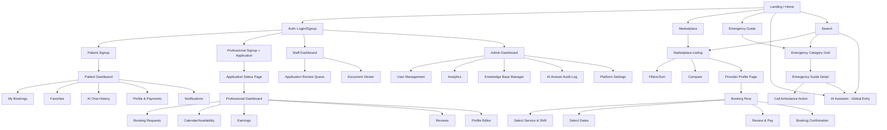
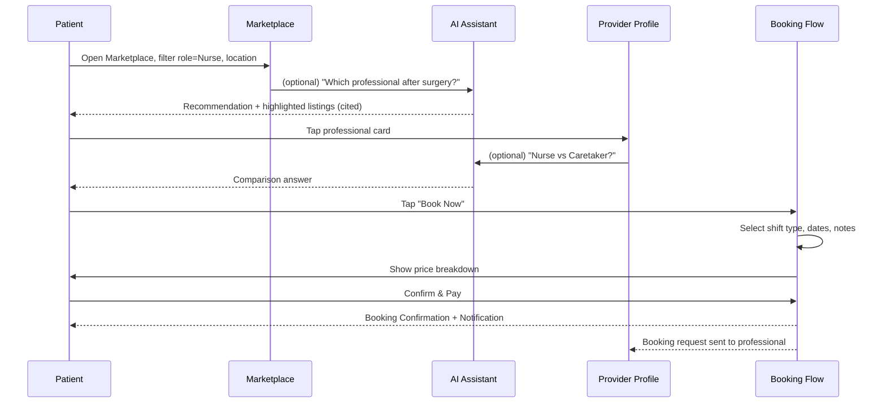
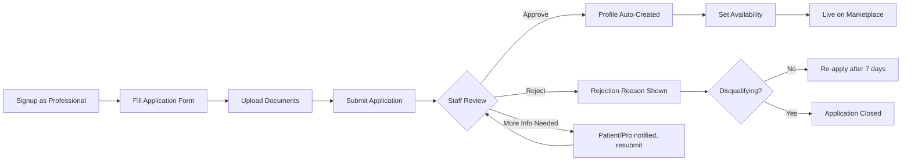
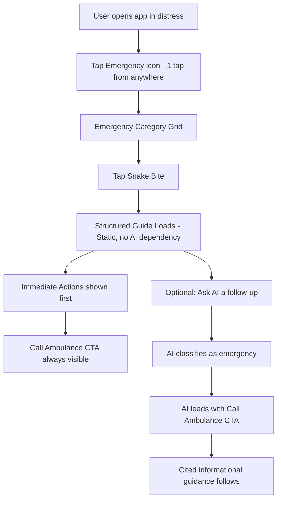
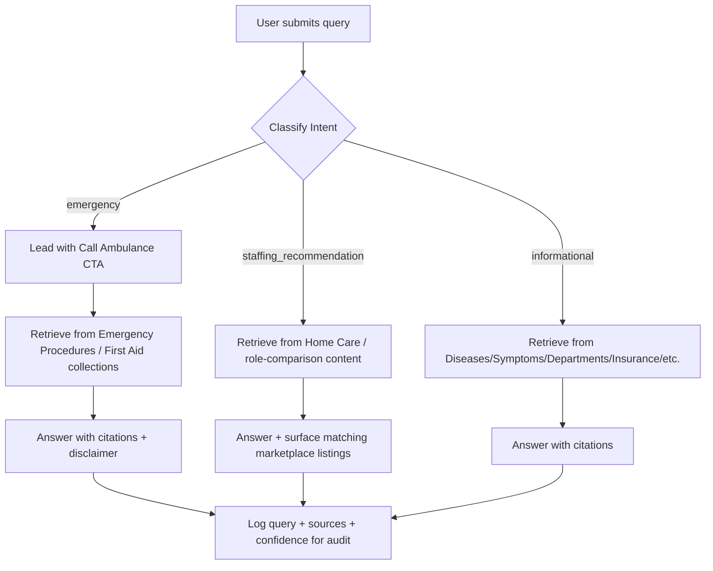

# Jeevan108 — Product Requirements Document (PRD)

**Product:** Jeevan108 — AI-Powered Healthcare Staffing & Emergency Assistance Platform
**Document Type:** Product Requirements Document
**Version:** 2.0 (Redesign)
**Status:** Draft for Engineering Handoff

---

## 1. Product Vision

Jeevan108 is not a hospital management system. It is a **two-sided healthcare staffing marketplace** combined with an **AI-native medical knowledge and emergency-guidance layer**. It exists to solve two connected problems that Indian households face:

1. **"I need trustworthy home healthcare help, right now, and I don't know who to hire."**
2. **"I don't know what to do — which department, which specialist, what to do before help arrives."**

Rather than bolting a chatbot onto a staffing app, Jeevan108 treats AI (via Retrieval-Augmented Generation) as connective tissue that runs through every screen — marketplace, booking, provider profiles, and a dedicated Emergency Guide — so that "who do I hire" and "what do I do" are answered in the same breath, grounded in a curated, citable medical knowledge base.

**North Star:** Every patient interaction — browsing, booking, or panicking during an emergency — is supported by verified human professionals and grounded AI guidance, never a black-box answer and never an unverified caregiver.

---

## 2. Objectives

| # | Objective | Description |
|---|-----------|--------------|
| O1 | Trusted staffing | Every professional visible in the marketplace has passed a verification workflow; patients never see unapproved profiles. |
| O2 | Frictionless hiring | A patient should be able to go from "I need a nurse" to a confirmed booking in under 5 minutes. |
| O3 | Grounded medical guidance | The AI assistant must answer from a curated knowledge base with citations — never an ungrounded, hallucinated medical answer. |
| O4 | Emergency-first design | Time-critical flows (ambulance, first aid, snake bite, burns, cardiac events) must be reachable within one tap from anywhere in the app. |
| O5 | Contextual AI, not a floating widget | AI assistance is embedded per-page (marketplace, booking, provider profile, emergency guide) with page-aware prompts, not a generic chat bubble. |
| O6 | Scalable service categories | Architecture and data model must support adding Physiotherapists, Lab Technicians, and Home Doctor Visits without redesign. |
| O7 | Operational trust for Admin/Staff | Admins need full visibility and control over applications, verification, bookings, and content in the knowledge base. |

---

## 3. Success Metrics

| Category | Metric | Target (V1, 6 months post-launch) |
|---|---|---|
| Marketplace | Time from search to booking confirmation | < 5 minutes median |
| Marketplace | % of bookings from verified professionals | 100% (hard requirement, not just a metric) |
| Trust | Professional verification turnaround (application → approved/rejected) | < 48 hours |
| AI Assistant | % of AI answers with at least 1 citation from knowledge base | 100% for medical/informational queries |
| AI Assistant | AI query → correct escalation to emergency flow (for emergency-flagged queries) | > 95% recall on a labeled test set |
| AI Assistant | User-rated "helpful" feedback on AI answers | > 80% thumbs-up |
| Engagement | Repeat booking rate (patients who book a 2nd time within 90 days) | > 30% |
| Emergency | Time to reach "Call Ambulance" action from app cold-open | ≤ 2 taps |
| Platform | Booking cancellation/no-show rate | < 8% |
| Ops | Admin time to review one professional application | < 10 minutes with the provided checklist UI |

---

## 4. User Personas

### 4.1 Patient — "Anjali, 34, caring for her father"
Anjali's father was discharged after a hip surgery and needs a caretaker for 2 weeks and occasional nurse visits for wound dressing. She has never hired a caregiver before, doesn't know the difference between a "nurse" and a "caretaker," and is anxious about safety/verification. She needs: clear role comparisons, verified profiles, transparent pricing, and an easy way to ask "is this normal?" questions.

### 4.2 Patient (Emergency) — "Rohan, 28, first responder to a home accident"
Rohan's neighbor was bitten by a snake. He opens the app in a panic. He needs: an emergency action within 1–2 taps, first-aid steps he can follow *before* help arrives, and a clear distinction between "call an ambulance now" vs. "informational guidance."

### 4.3 Healthcare Professional — "Meera, 42, home nurse"
Meera wants steady, verified work. She needs a simple application flow, clear status tracking (pending/approved/rejected with reasons), a profile that showcases her certifications, and a dashboard to manage booking requests and her calendar.

### 4.4 Staff — "Verification Officer"
Reviews incoming applications, checks documents/certifications, and either approves, rejects, or requests more info. Needs a queue-based UI, not ad hoc email threads.

### 4.5 Admin — "Platform Operator"
Owns platform health: user management, dispute resolution, analytics, and — critically — curation of the AI knowledge base (adding/editing/retiring documents, reviewing flagged AI answers).

---

## 5. User Roles & Permissions

| Role | Sub-types | Core Permissions |
|---|---|---|
| **Patient** | — | Browse marketplace, book professionals, manage bookings, use AI assistant, rate/review professionals, manage own profile |
| **Healthcare Professional** | Nurse, Caretaker, Compounder (extensible to Physiotherapist, Lab Technician, Home Doctor) | Submit application, manage professional profile, accept/reject/reschedule bookings, view earnings, use AI assistant (professional-context) |
| **Staff** | Verification Officer, Support Agent | Review applications, approve/reject professionals, view bookings for support/dispute handling, cannot modify knowledge base or platform-wide settings |
| **Admin** | Super Admin, Content Admin | All Staff permissions + user management, analytics dashboard, knowledge base curation (CRUD on RAG collections), platform configuration, role management |

Role-based access control (RBAC) is enforced at the API Gateway and re-validated in each microservice (see SRD §7).

---

## 6. Functional Requirements

### 6.1 Authentication & Onboarding
- FR-1.1: Users register via email/password or phone OTP; role selected at signup (Patient / Healthcare Professional).
- FR-1.2: Healthcare Professional signup routes into the Application flow before any dashboard access is granted.
- FR-1.3: JWT-based session with refresh tokens; access token expiry 15 min, refresh token 7 days (rotating).
- FR-1.4: Password reset via OTP (email or SMS).
- FR-1.5: Admin/Staff accounts are provisioned by Super Admin only — no public signup for these roles.

### 6.2 Healthcare Professional Application & Verification
- FR-2.1: Multi-step application form: Personal Details → Role Selection (Nurse/Caretaker/Compounder) → Certifications/Documents Upload → Experience → Availability → Review & Submit.
- FR-2.2: Uploaded documents (ID proof, certification, experience letters) stored via File Storage service, virus-scanned, and linked to the application record.
- FR-2.3: Application status states: `draft → submitted → under_review → approved | rejected | more_info_requested`.
- FR-2.4: Staff can leave structured rejection reasons (from a predefined taxonomy) and free-text notes.
- FR-2.5: On approval, a Professional Profile is auto-created (editable) and becomes eligible for marketplace listing after the professional confirms availability.
- FR-2.6: Re-application allowed after rejection with a 7-day cooldown, unless rejection reason is "disqualifying" (e.g., failed background check).

### 6.3 Marketplace
- FR-3.1: Patients can browse professionals filtered by: role (Nurse/Caretaker/Compounder), location/pincode radius, availability dates, price range, rating, years of experience, languages spoken, gender preference.
- FR-3.2: Sort options: Best match (AI-assisted ranking), Price (low–high/high–low), Rating, Distance.
- FR-3.3: Compare mode: patient can select up to 3 professionals to compare side-by-side (price, rating, experience, certifications).
- FR-3.4: Each listing card shows: photo, verified badge, role, rating, years of experience, starting price, distance, next available date.
- FR-3.5: AI contextual prompt embedded on the marketplace page (e.g., "Which professional should I hire after surgery?") returns a natural-language recommendation *and* filters/highlights matching listings.

### 6.4 Provider (Professional) Profile Page
- FR-4.1: Displays full profile: bio, certifications (with verified badges), experience, service radius, pricing per shift type (hourly/12-hr/24-hr/live-in), reviews, availability calendar.
- FR-4.2: "Should I hire a caretaker or a nurse?" contextual AI prompt available directly on the profile, pre-scoped to the professional's role for a relevant comparison.
- FR-4.3: "Book Now" and "Message" (pre-booking query) CTAs.

### 6.5 Booking
- FR-5.1: Booking flow: Select professional → Select service type & shift pattern → Select dates/times → Add patient care notes → Review pricing → Confirm → Payment (or Pay-on-service, configurable) → Confirmation.
- FR-5.2: Booking states: `requested → accepted | declined → confirmed → in_progress → completed | cancelled`.
- FR-5.3: Professional can accept/decline within a configurable SLA (default 2 hours); auto-cancel with patient notification if SLA breached.
- FR-5.4: Rescheduling allowed up to 12 hours before start time (configurable per professional).
- FR-5.5: Post-completion: mutual rating/review (patient rates professional; professional rates patient household conditions, internal-only).
- FR-5.6: AI contextual prompt during booking (e.g., "Which healthcare professional is suitable for stroke recovery?") to help the patient validate/adjust their selection before confirming.

### 6.6 Dashboards

**Patient Dashboard**
- FR-6.1: Upcoming/past bookings, saved/favorited professionals, active AI conversation history, notifications, profile & payment methods.

**Healthcare Professional Dashboard**
- FR-6.2: Application status (if pending), incoming booking requests, calendar/availability management, earnings summary, reviews received, profile completeness meter.

**Staff Dashboard**
- FR-6.3: Application review queue (sortable/filterable by role, submission date, SLA breach risk), document viewer, approve/reject/request-info actions.

**Admin Dashboard**
- FR-6.4: Platform-wide analytics (bookings, GMV, active professionals, application funnel), user management, knowledge base management (RAG document CRUD, collection management, AI answer audit log with flag/review workflow), system health widgets.

### 6.7 Notifications
- FR-7.1: Channels: in-app, push (mobile web), email, SMS (for booking confirmations and emergency-adjacent transactional messages).
- FR-7.2: Trigger events: application status change, booking request/accept/decline/cancel, booking reminder (T-24h, T-1h), review request, AI escalation to emergency flow (in-app banner only, non-intrusive).

### 6.8 AI Knowledge Assistant (RAG)
- FR-8.1: Global entry point (persistent but unobtrusive icon) plus **contextual, page-embedded prompt suggestions** on: Marketplace, Booking flow, Provider Profile, Emergency Guide, Dashboard.
- FR-8.2: Every substantive answer must include inline citations referencing the knowledge base document(s) used (title + collection).
- FR-8.3: The assistant must classify each query into one of: `informational`, `staffing_recommendation`, `emergency`. Classification drives UI treatment (see §6.9 and §11).
- FR-8.4: For `emergency`-classified queries, the assistant must lead with a prominent "Call Ambulance / Emergency Services" CTA before the informational content, and clearly label content as "General guidance — not a substitute for professional medical care."
- FR-8.5: Conversation history is persisted per patient (for continuity) and is visible/exportable by the patient.
- FR-8.6: Admin can review flagged/low-confidence AI answers and correct/expand the knowledge base accordingly (feedback loop).
- FR-8.7: The assistant must decline to give definitive diagnoses or prescribe medication dosages; it provides informational/triage-level guidance only and directs to a qualified professional or emergency services for anything beyond that.

### 6.9 Emergency Guide
- FR-9.1: Dedicated, always-reachable section (max 2 taps from any screen) listing common emergencies (snake bite, burns, cardiac event, choking, knocked-out tooth, road accident, stroke, seizure) as tappable cards.
- FR-9.2: Each emergency card opens a structured guide: **Immediate Actions (numbered, do-this-now)** → **What NOT to do** → **When to call an ambulance** → **What to do before help arrives** → related AI Q&A entry point pre-scoped to that emergency.
- FR-9.3: One-tap "Call Ambulance" (tel: link) always visible on emergency guide screens.
- FR-9.4: Emergency Guide content is sourced from the same RAG knowledge base (Emergency Procedures + First Aid collections) but rendered as pre-formatted structured guides, not free-form chat, for speed and clarity under stress.

### 6.10 Search
- FR-10.1: Global search bar supporting three intents simultaneously: professional search (by name/role/location), knowledge base search (symptom/condition/procedure keywords), and emergency guide search — results grouped by category.

### 6.11 Administration & Analytics
- FR-11.1: Admin can manage user accounts (suspend/reinstate), view audit logs, configure platform settings (SLA thresholds, commission rates, service categories).
- FR-11.2: Analytics: booking funnel, application funnel, AI query volume & category breakdown, top unanswered/low-confidence AI queries, professional supply/demand heatmap by location.

---

## 7. Non-Functional Requirements

| Category | Requirement |
|---|---|
| Performance | Marketplace listing API p95 < 400ms; AI assistant first-token latency < 2s; full RAG answer < 6s p95 |
| Availability | 99.5% uptime for core booking/marketplace services; Emergency Guide content must be cacheable client-side and available offline-first (static guide content) |
| Scalability | Each microservice must scale independently; AI Service must handle burst load (e.g., regional emergency events) without degrading booking service performance |
| Security | All PII encrypted at rest; documents (ID proofs, certifications) stored in access-controlled buckets with signed URLs; RBAC enforced at gateway and service level |
| Privacy | Patient AI conversations treated as sensitive health data; data retention policy configurable; right-to-delete supported |
| Accessibility | WCAG 2.1 AA compliance for patient-facing flows, especially Emergency Guide (large tap targets, high contrast, screen-reader labels) |
| Localization | UI and knowledge base content structured to support multi-language expansion (English + Hindi + regional languages) in roadmap phase 2 |
| Auditability | All AI answers logged with retrieved source documents for compliance/audit; all verification decisions logged with actor and timestamp |
| Reliability of AI | AI Service must degrade gracefully — if the LLM/vector DB is unavailable, Emergency Guide static content must still render (it does not depend on live AI inference) |
| Mobile-first | All patient and professional flows must be fully usable on mobile web (majority of traffic expected on mobile) |

---

## 8. Information Architecture

### 8.1 Site Map

### 8.2 Complete Page Inventory

| # | Page | Roles | Key Purpose |
|---|---|---|---|
| 1 | Landing / Home | All (public) | Value prop, entry to marketplace/emergency/search |
| 2 | Login | All | Auth |
| 3 | Signup (Patient) | Public | Create patient account |
| 4 | Signup (Professional) | Public | Create professional account → routes to Application |
| 5 | Forgot/Reset Password | All | OTP-based reset |
| 6 | Marketplace Listing | Patient | Browse/filter/sort/compare professionals |
| 7 | Provider Profile | Patient | View full professional profile, AI Q&A, booking CTA |
| 8 | Booking Flow (multi-step) | Patient | Select service → dates → review → confirm |
| 9 | Booking Confirmation | Patient | Summary + next steps |
| 10 | Patient Dashboard — My Bookings | Patient | Upcoming/past/cancelled bookings |
| 11 | Patient Dashboard — Favorites | Patient | Saved professionals |
| 12 | Patient Dashboard — AI Chat History | Patient | Past AI conversations |
| 13 | Patient Dashboard — Profile & Payments | Patient | Edit profile, manage payment methods |
| 14 | Patient Dashboard — Notifications | Patient | Notification center |
| 15 | Emergency Guide — Category Grid | All | Tappable emergency categories |
| 16 | Emergency Guide — Detail | All | Structured emergency instructions |
| 17 | AI Assistant (Global) | All (role-aware) | Full-screen/panel chat with citations |
| 18 | Search Results | All | Grouped results: professionals / KB / emergency |
| 19 | Professional Application (multi-step) | Professional | Submit application |
| 20 | Application Status | Professional | Track approval status |
| 21 | Professional Dashboard — Booking Requests | Professional | Accept/decline requests |
| 22 | Professional Dashboard — Calendar | Professional | Manage availability |
| 23 | Professional Dashboard — Earnings | Professional | Earnings history/payouts |
| 24 | Professional Dashboard — Reviews | Professional | View ratings/feedback |
| 25 | Professional Dashboard — Profile Editor | Professional | Edit public profile |
| 26 | Staff Dashboard — Application Queue | Staff | Review/approve/reject applications |
| 27 | Staff Dashboard — Document Viewer | Staff | Inspect uploaded certifications/IDs |
| 28 | Admin Dashboard — Overview/Analytics | Admin | Platform KPIs |
| 29 | Admin Dashboard — User Management | Admin | Manage all accounts |
| 30 | Admin Dashboard — Knowledge Base Manager | Admin | CRUD on RAG documents/collections |
| 31 | Admin Dashboard — AI Answer Audit Log | Admin | Review flagged/low-confidence answers |
| 32 | Admin Dashboard — Platform Settings | Admin | SLAs, commission, categories |
| 33 | 404 / Error / Offline (Emergency fallback) | All | Graceful degradation, static emergency content still visible |

---

## 9. Core Modules (Cross-Reference)

| Module | Primary Pages | Primary Services (see SRD) |
|---|---|---|
| Authentication | Login, Signup, Reset Password | Authentication Service |
| Applications | Professional Application, Application Status, Staff Queue | Application & Verification Service |
| Professional Verification | Staff Document Viewer | Application & Verification Service |
| Marketplace | Marketplace Listing, Compare | Marketplace Service, Search Service |
| Booking | Booking Flow, Confirmation, Booking Requests | Booking Service |
| Profiles | Provider Profile, Profile Editor, Patient Profile | User Service, Professional Service |
| Dashboards | All dashboards | Aggregated via API Gateway/BFF pattern |
| Notifications | Notification Center | Notification Service |
| Knowledge Assistant | AI Assistant, contextual prompts | AI Knowledge Service |
| Emergency Guides | Emergency Category Grid/Detail | AI Knowledge Service (content), served statically |
| Search | Search Results | Search Service |
| Administration | Admin Dashboard (all sub-pages) | User Service, Application Service, AI Knowledge Service |
| Analytics | Admin Analytics | Analytics aggregation (via Admin BFF) |

---

## 10. User Flows

### 10.1 Patient: Hire a Nurse (Happy Path)

### 10.2 Professional: Application to Approval

### 10.3 Emergency Flow (Snake Bite Example)

### 10.4 AI Query Classification & Routing

---

## 11. Component-Level Requirements

### 11.1 AI Assistant Panel (used across pages, contextually scoped)
- Persistent icon (bottom-right on desktop, bottom tab on mobile) — never blocks primary CTAs.
- On open: shows page-aware suggested prompts (e.g., on Booking page: "Which professional suits stroke recovery?").
- Response rendering:
  - Emergency-classified: red/amber banner with "Call Ambulance" button pinned to top of the answer, phone icon, `tel:` link.
  - Citations rendered as numbered chips `[1] [2]` linking to expandable source snippets (title, collection, last-updated date).
  - Disclaimer footer: "This is general guidance, not a medical diagnosis. For emergencies, call emergency services immediately."
- Feedback: thumbs up/down per answer, optional free-text ("What was wrong?") — feeds Admin audit log.
- Conversation persists per patient; accessible from Dashboard → AI Chat History.

### 11.2 Marketplace Listing Card
- Fields: photo (fallback avatar), name, role badge, verified checkmark (tooltip: "Verified by Jeevan108"), star rating (1 decimal) + review count, years of experience, starting price (₹/shift), distance (km), next available date, "Compare" checkbox, "Book Now" quick action.
- Empty state: "No professionals match your filters" + AI prompt: "Ask AI for help choosing."
- Loading state: skeleton cards (min 6).

### 11.3 Filter Panel
- Role (multi-select chips: Nurse/Caretaker/Compounder, disabled chips for "Coming Soon: Physiotherapist/Lab Technician/Home Doctor").
- Location radius slider (1–25 km) with pincode/address autocomplete.
- Price range (dual slider, ₹).
- Rating minimum (star selector).
- Availability date picker.
- Language spoken (multi-select).
- Gender preference (optional, radio: Any/Male/Female).
- "Reset filters" and result count live update.

### 11.4 Booking Flow Stepper
- Step 1 — Service & Shift: shift types (Hourly / 12-hr / 24-hr / Live-in), quantity selector.
- Step 2 — Dates: calendar with professional's blocked/available dates pre-rendered; conflict warning if overlapping an existing booking.
- Step 3 — Care Notes: free-text (max 500 chars) + optional AI-assisted structuring ("Summarize care needs for the professional").
- Step 4 — Review & Pay: itemized price (base rate × duration + platform fee − any discount), payment method selector, terms checkbox.
- Step 5 — Confirmation: booking ID, professional contact reveal (post-confirmation only, for privacy), calendar-add action, "Ask AI about recovery care" follow-up prompt.

### 11.5 Application Form (Professional)
- Step 1 — Personal Details: name, DOB (18+ validation), phone (OTP verify), address, photo upload.
- Step 2 — Role Selection: single-select (Nurse/Caretaker/Compounder), role-specific sub-fields (e.g., Nurse → nursing license number).
- Step 3 — Documents: ID proof (Aadhaar/PAN/Passport — one required), certification(s) upload (min 1 for Nurse/Compounder), experience letters (optional), all as PDF/JPG/PNG ≤ 5MB each.
- Step 4 — Experience: years, previous employers (repeatable field group), specializations (multi-select, e.g., post-surgical, geriatric, pediatric, wound care).
- Step 5 — Availability: preferred shift types, service radius, expected rate range.
- Step 6 — Review & Submit: summary view, edit-in-place, consent checkbox (background verification), Submit.
- Autosave draft at every step transition.

### 11.6 Emergency Guide Card & Detail
- Category grid: icon + label (Snake Bite, Burns, Cardiac Event, Choking, Knocked-Out Tooth, Road Accident, Stroke, Seizure, + "See all") — minimum tap target 48×48px.
- Detail template (fixed structure, populated from KB):
  1. Header with severity indicator and "Call Ambulance" button (always visible, sticky).
  2. "Do This Now" — numbered list, max 6 steps, imperative language.
  3. "Do NOT" — short bulleted list.
  4. "Call an ambulance if…" — bulleted trigger conditions.
  5. "While you wait" — supportive actions.
  6. "Ask AI a follow-up" — pre-filled prompt scoped to this emergency.
- This page must render from a locally cached/static bundle so it works even if AI/network is degraded (see NFR).

### 11.7 Staff Application Review Queue
- Table/list view: applicant name, role, submitted date, SLA countdown (color-coded: green >24h, amber 12–24h, red <12h), status.
- Row click → Document Viewer split-pane (documents left, structured application data + decision panel right).
- Decision panel: Approve / Reject (reason taxonomy dropdown + notes) / Request More Info (free text) buttons.

### 11.8 Admin Knowledge Base Manager
- Collection browser (Diseases, Symptoms, Departments, Treatments, Emergency Procedures, First Aid, Insurance, Ambulance, Medicines, Home Care, Hospital Policies, FAQs).
- Document list per collection: title, last updated, status (published/draft), source/author.
- Document editor: rich text / markdown, metadata fields (tags, related collections, review-by date), "Preview retrieval" tool to test how this doc would be retrieved for sample queries.
- AI Answer Audit Log: table of logged queries with classification, confidence score, sources used, user feedback (thumbs up/down), filter by "flagged" or "low confidence"; click-through to see full Q&A and quickly patch/add a KB document.

---

## 12. Validation Rules

| Field/Flow | Rule |
|---|---|
| Email | RFC 5322 format; uniqueness enforced at signup |
| Phone | 10-digit Indian mobile format (extensible), OTP verification required before activation |
| Password | Min 8 chars, at least 1 letter + 1 number; bcrypt/argon2 hashed server-side |
| Professional DOB | Must indicate age ≥ 18 |
| Document uploads | Allowed types: PDF, JPG, PNG; max 5MB per file; virus scan required before storage confirmation |
| Booking dates | Start date/time must be ≥ 2 hours from now (configurable); end date/time must be after start |
| Booking overlap | System must reject a new booking that overlaps an existing `confirmed`/`in_progress` booking for the same professional |
| Price range filter | Min ≤ Max, both ≥ 0 |
| Rating input | Integer 1–5 required; text review optional, max 1000 chars |
| Care notes | Max 500 chars, HTML-stripped/sanitized |
| AI query input | Max 1000 chars per message; rate-limited per user (see SRD §Rate Limiting) |
| Application resubmission | Blocked for 7 days after non-disqualifying rejection; blocked permanently after disqualifying rejection unless Admin override |
| File-based KB documents (Admin) | Must specify at least 1 collection tag before publishing; cannot publish empty-body documents |

---

## 13. AI Feature Requirements (Detailed)

| # | Requirement |
|---|---|
| AI-1 | RAG pipeline must retrieve from a vector database populated exclusively from Admin-curated collections listed in §Knowledge Base — no open-web retrieval for medical content. |
| AI-2 | Every answer involving medical/procedural claims must include ≥1 citation; if retrieval confidence is below threshold, the assistant must respond with a graceful fallback ("I don't have verified information on this — please consult a doctor or call emergency services") rather than guessing. |
| AI-3 | Query classification (`informational` / `staffing_recommendation` / `emergency`) must run before generation so UI treatment (emergency banner) can be applied deterministically, not inferred post-hoc from free text. |
| AI-4 | Emergency-classified queries must never be blocked or delayed by retrieval latency for the "Call Ambulance" CTA — CTA renders immediately; the cited content streams in after. |
| AI-5 | Contextual prompts are page-scoped: the same underlying assistant, but the frontend passes a `context` parameter (e.g., `page=booking`, `professionalRole=nurse`) that biases retrieval and prompt suggestions. |
| AI-6 | The assistant must never recommend a specific unverified individual outside the platform's marketplace; staffing recommendations must map back to filterable marketplace criteria (role, specialization), not named third parties. |
| AI-7 | The assistant must not provide medication dosage instructions or diagnostic conclusions; it may describe general information about medicines/treatments sourced from the Medicines/Treatments collections but must direct dosage/diagnosis questions to a professional. |
| AI-8 | All AI interactions logged (query, classification, retrieved doc IDs, response, latency, user feedback) for the Admin Audit Log, retained per data retention policy. |
| AI-9 | Multi-turn context: the assistant must retain conversation context within a session (e.g., follow-up "how long does that take?" resolves against prior turn) up to a configurable window (default: last 10 turns). |

---

## 14. Future Roadmap

| Phase | Scope |
|---|---|
| Phase 1 (V1 — this PRD) | Nurse/Caretaker/Compounder marketplace, booking, verification, RAG assistant, Emergency Guide, dashboards for all 4 roles |
| Phase 2 | Physiotherapists, Lab Technicians, Home Doctor Visits added as marketplace categories; multi-language UI + KB (Hindi + 1 regional language); in-app payments with escrow |
| Phase 3 | Insurance-provider integration (claims guidance grounded in RAG); wearable/vitals integration for at-home monitoring alerts; subscription care plans (recurring bookings) |
| Phase 4 | Kubernetes-based multi-region deployment; hospital partner network integration (referral flow from AI assistant to partner hospitals); voice-based emergency assistant (for hands-free use during an incident) |
| Ongoing | Continuous knowledge base expansion and AI answer quality review via the Admin Audit Log feedback loop |

---

*End of Product Requirements Document. See companion System Requirements Document (SRD) for engineering architecture.*
