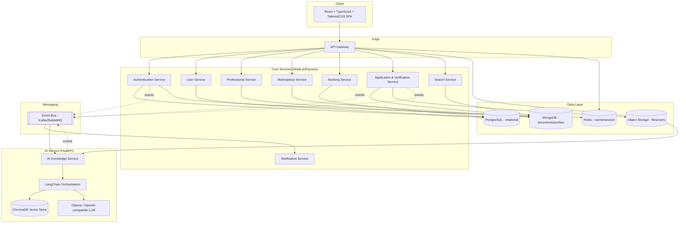
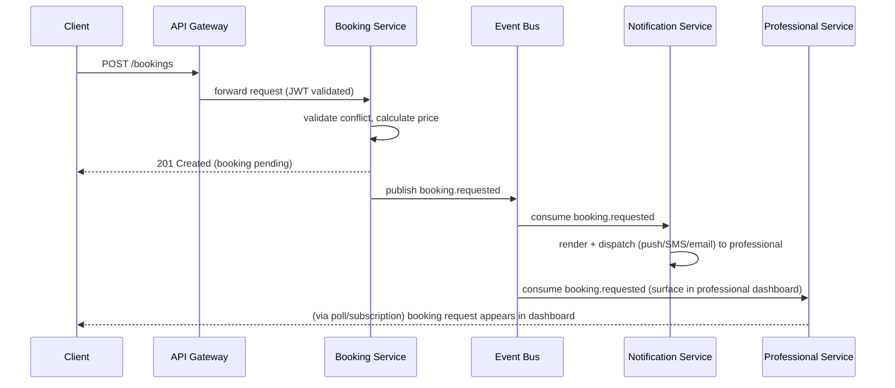
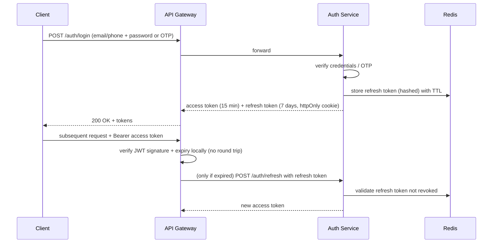
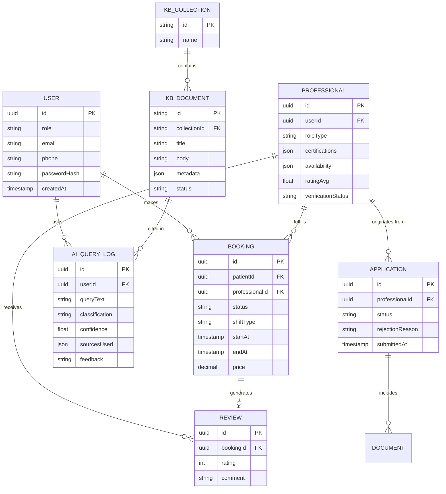
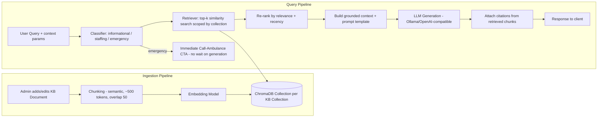
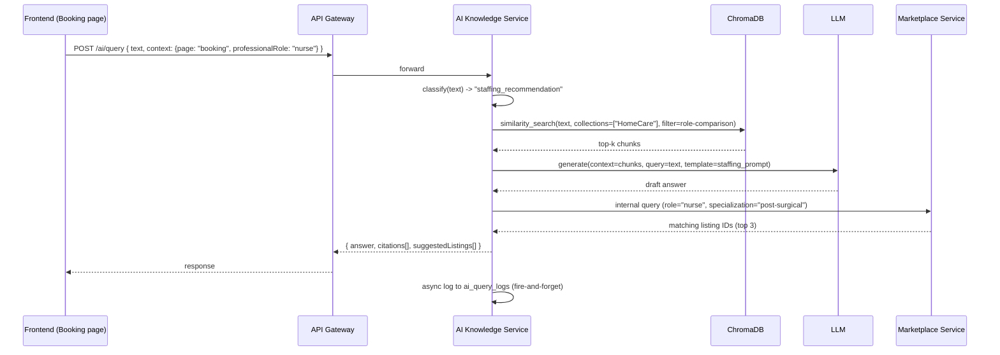
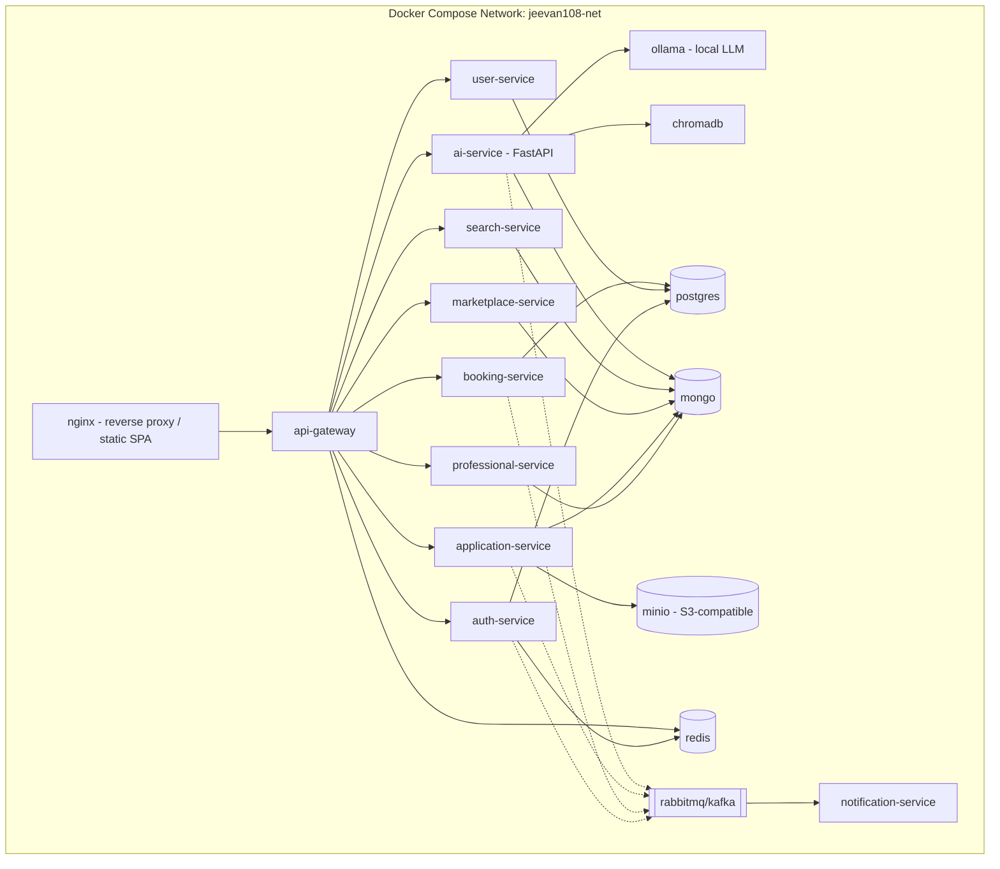

# Jeevan108 — System Requirements Document (SRD)

**Product:** Jeevan108 — AI-Powered Healthcare Staffing & Emergency Assistance Platform
**Document Type:** System Requirements Document (Engineering Architecture)
**Version:** 2.0 (Redesign)
**Companion Document:** Jeevan108 PRD v2.0

---

## 1. Overall System Architecture

Jeevan108 follows a **microservices architecture** with a single **API Gateway** as the entry point, independent Node.js/Express services for core business domains, and a dedicated **Python/FastAPI AI Knowledge Service** housing the RAG pipeline. Services communicate synchronously via REST for request/response needs and asynchronously via an event bus for cross-service side effects (notifications, analytics, audit logging).



**Architectural principles**
1. Each service owns its data — no service reaches into another service's database directly.
2. The API Gateway is the only public entry point; internal services communicate over a private network.
3. The AI Knowledge Service is stateless with respect to business data — it only reads from the vector store and calls back to core services (e.g., Marketplace Service) to resolve staffing recommendations into real, bookable listings.
4. Emergency Guide static content is served from a CDN-cached bundle independent of live AI inference to guarantee availability under load or AI-service degradation.

---

## 2. Microservice Breakdown & Responsibilities

| Service | Responsibility | Owns Data |
|---|---|---|
| **API Gateway** | Single entry point; routing, auth token validation, rate limiting, request aggregation (BFF for dashboards), request/response logging | None (stateless) |
| **Authentication Service** | Signup/login, OTP verification, JWT issuance/refresh, password reset, RBAC role assignment | `users_auth` (PostgreSQL): credentials, roles, sessions |
| **User Service** | Patient/base user profile management, preferences, payment method references | `users` (PostgreSQL): profile, contact info |
| **Professional Service** | Professional profile (post-approval), availability calendar, service radius, specializations, ratings aggregation | `professionals` (MongoDB): profile documents |
| **Application & Verification Service** | Application intake, document upload orchestration, status workflow, staff decisions, rejection taxonomy | `applications` (MongoDB), file refs to S3 |
| **Marketplace Service** | Listing composition (joins Professional + rating + availability), filter/sort/compare logic | `listings_cache` (MongoDB, denormalized read model) |
| **Booking Service** | Booking lifecycle (request → confirm → complete), pricing calculation, SLA timers, conflict detection | `bookings` (PostgreSQL) |
| **Notification Service** | Multi-channel dispatch (in-app, push, email, SMS), templating, delivery status | `notifications` (MongoDB), delivery logs |
| **AI Knowledge Service** | RAG pipeline: query classification, retrieval, generation, citation assembly, contextual prompt resolution, audit logging | Vector store (ChromaDB), `ai_query_logs` (MongoDB) |
| **Search Service** | Federated search across professionals, KB documents, emergency guides | Search indices (MongoDB Atlas Search or OpenSearch) |
| **Analytics/Audit (embedded in Admin BFF)** | Aggregates events from bus into read-optimized dashboards | `analytics_events` (columnar store, e.g., ClickHouse — optional) |

---

## 3. API Gateway Responsibilities

- **Routing:** path-based routing to internal services (e.g., `/api/v1/marketplace/*` → Marketplace Service).
- **Authentication enforcement:** validates JWT signature/expiry on every protected route; rejects with `401` before forwarding.
- **Authorization pre-check:** coarse-grained RBAC (role must be permitted to hit this route at all); fine-grained checks happen in-service.
- **Rate limiting:** per-user and per-IP token-bucket limiting (see §Rate Limiting).
- **Request aggregation (BFF):** dashboard endpoints (e.g., `GET /api/v1/dashboard/patient`) fan out to User, Booking, and Notification services and merge responses to minimize client round-trips.
- **Logging & tracing:** injects a `X-Request-ID` and `X-Correlation-ID` for distributed tracing; structured access logs shipped to the logging pipeline.
- **TLS termination** and CORS policy enforcement.
- **Circuit breaking:** if a downstream service is unhealthy, gateway returns a graceful degraded response (e.g., Emergency Guide static fallback) rather than a hard 5xx where possible.

---

## 4. Service-to-Service Communication

| Pattern | Used For | Mechanism |
|---|---|---|
| Synchronous REST | Client-triggered reads/writes needing immediate response (e.g., booking creation, listing fetch) | HTTP/JSON over internal network, service discovery via DNS (Docker Compose network / k8s Service in future) |
| Asynchronous events | Cross-service side effects that don't block the user-facing request | Event bus (Kafka or RabbitMQ) — topics per domain event |
| Internal service calls from AI Service | AI Service resolving a "staffing_recommendation" into real listings | AI Service calls Marketplace Service's internal read API (`/internal/marketplace/query`) synchronously, with a timeout + fallback to text-only answer |

### 4.1 Event Catalog

| Event | Producer | Consumers | Payload (summary) |
|---|---|---|---|
| `user.registered` | Authentication Service | Notification, User Service | userId, role, email/phone |
| `application.submitted` | Application Service | Notification, Analytics | applicationId, professionalId |
| `application.status_changed` | Application Service | Notification, Professional Service, Analytics | applicationId, oldStatus, newStatus |
| `booking.requested` | Booking Service | Notification, Analytics | bookingId, patientId, professionalId |
| `booking.confirmed` | Booking Service | Notification, Professional Service, Analytics | bookingId |
| `booking.cancelled` | Booking Service | Notification, Analytics | bookingId, reason |
| `ai.query_logged` | AI Knowledge Service | Analytics, Admin Audit | queryId, classification, confidence, sourcesUsed |
| `ai.emergency_flagged` | AI Knowledge Service | Notification (in-app banner only), Analytics | queryId, category |
| `review.submitted` | Booking Service | Professional Service (rating recompute), Analytics | bookingId, rating |

---

## 5. Event Flow (Booking → Notification Example)



---

## 6. Authentication Flow



- Tokens: JWT signed with RS256; public key distributed to Gateway for local verification (avoids a network hop to Auth Service on every request).
- Refresh tokens are rotated on each use and stored (hashed) in Redis with revocation support (logout-all-devices).
- Role and permission claims embedded in the JWT payload; re-validated against the DB on sensitive operations (e.g., approving an application) to prevent stale-privilege abuse.

---

## 7. API Design Principles

- RESTful resource-oriented URIs: `/api/v1/{resource}/{id}/{sub-resource}` (e.g., `/api/v1/professionals/{id}/availability`).
- Versioned from day 1 (`/api/v1/...`) to allow non-breaking evolution.
- Consistent envelope: `{ "data": ..., "meta": {...}, "error": null }` on success; `{ "data": null, "error": { "code", "message", "details" } }` on failure.
- Standard HTTP status codes; domain-specific error codes in the `error.code` field (e.g., `BOOKING_CONFLICT`, `APPLICATION_NOT_FOUND`).
- Pagination via `?page=&limit=` with `meta.totalCount`/`meta.hasMore`.
- Idempotency keys (`Idempotency-Key` header) required on booking/payment-mutating POSTs to prevent duplicate submissions on retry.
- Internal-only endpoints prefixed `/internal/*`, not exposed through the public Gateway route table, used for service-to-service calls (e.g., AI Service → Marketplace Service).

---

## 8. Database Design

### 8.1 Technology choice per service
- **PostgreSQL:** Authentication, User, Booking — relational integrity matters (foreign keys, transactional booking state).
- **MongoDB:** Professional, Application, Marketplace (denormalized read model), Search indices, AI query logs — flexible/document-shaped data (varying certification fields, evolving KB metadata).
- **Redis:** session/refresh-token store, rate-limit counters, marketplace listing cache.
- **Object storage (S3-compatible/MinIO):** application documents, certifications, profile photos.
- **ChromaDB:** vector embeddings for the RAG knowledge base.

### 8.2 Core Entity-Relationship (Conceptual)



### 8.3 Collection/Table Ownership

| Data | Owning Service | Store |
|---|---|---|
| `users_auth` (credentials, roles, sessions) | Authentication Service | PostgreSQL |
| `users` (profile, preferences) | User Service | PostgreSQL |
| `professionals` (profile, availability, ratings) | Professional Service | MongoDB |
| `applications`, `documents` (metadata; blobs in S3) | Application & Verification Service | MongoDB + S3 |
| `listings_cache` (denormalized marketplace read model) | Marketplace Service | MongoDB (rebuilt from Professional Service events) |
| `bookings` | Booking Service | PostgreSQL |
| `reviews` | Booking Service (or split into Review sub-domain later) | PostgreSQL |
| `notifications`, delivery logs | Notification Service | MongoDB |
| `kb_collections`, `kb_documents` | AI Knowledge Service | MongoDB (source of truth) + ChromaDB (embeddings, derived) |
| `ai_query_logs` | AI Knowledge Service | MongoDB |
| Search indices | Search Service | MongoDB Atlas Search / OpenSearch (derived from other services via events) |

No service queries another service's store directly; all cross-service reads go through internal APIs or consume events to build local read models (e.g., Marketplace Service's `listings_cache` is built by consuming `professional.updated` events).

---

## 9. File Storage

- All uploaded files (ID proofs, certifications, profile photos) go to an **S3-compatible object store** (AWS S3 in production, MinIO in local/dev Docker Compose).
- Upload flow: client requests a **pre-signed upload URL** from Application & Verification Service → uploads directly to storage → service confirms and records metadata (path, checksum, virus-scan status) in `documents`.
- Files are never served publicly; retrieval is via **short-lived signed GET URLs** generated on demand (e.g., for Staff Document Viewer).
- Virus scanning via an async worker (e.g., ClamAV sidecar) triggered on upload-confirmed event; documents are `pending_scan` until cleared.
- Bucket layout: `jeevan108-uploads/{applicationId}/{documentType}/{filename}`.

---

## 10. RAG Architecture

### 10.1 Pipeline Overview



### 10.2 Components (LangChain-orchestrated, served via FastAPI)
- **Document loader & chunker:** ingests Admin-authored KB documents (Markdown/rich text), splits into ~500-token semantic chunks with 50-token overlap, preserving section headers as metadata.
- **Embedding model:** configurable (local via Ollama-compatible embedding model, or OpenAI-compatible embeddings API) — must be swappable via config, not hardcoded.
- **Vector store:** ChromaDB, one **collection-per-KB-collection** (Diseases, Symptoms, Departments, Treatments, Emergency Procedures, First Aid, Insurance, Ambulance, Medicines, Home Care, Hospital Policies, FAQs) to allow scoped retrieval (e.g., Emergency Guide only searches Emergency Procedures + First Aid).
- **Query classifier:** lightweight LLM call or fine-tuned classifier run **before** the main retrieval/generation, tagging `informational` / `staffing_recommendation` / `emergency`. This gates UI behavior deterministically (PRD FR-8.3/AI-3).
- **Retriever:** top-k (default k=5) similarity search, metadata-filtered by relevant collection(s) inferred from classification + page context (`context` param from frontend).
- **Re-ranker:** simple recency + relevance re-rank before context assembly (documents flagged `review-by date` past due are deprioritized).
- **Prompt template:** system prompt enforces: cite sources, no diagnosis, no dosages, lead with emergency CTA when applicable, use plain language.
- **Generator:** Ollama (self-hosted, e.g., Llama/Mistral class model) or any OpenAI-compatible endpoint — abstracted behind a common interface so the LLM provider can be swapped via environment variable.
- **Citation assembler:** maps generation output back to the specific retrieved chunk IDs/titles for the citation chips in the UI.
- **Audit logger:** every query/response/sources/confidence/latency logged to `ai_query_logs`, feeding the Admin Audit Log.

### 10.3 AI Request Flow (Contextual Example: Booking Page)



### 10.4 Vector Database Design

- **Collections in ChromaDB** map 1:1 to KB collections listed in PRD §Knowledge Base: `diseases`, `symptoms`, `departments`, `treatments`, `emergency_procedures`, `first_aid`, `insurance`, `ambulance`, `medicines`, `home_care`, `hospital_policies`, `faqs`.
- Each vector record metadata: `{ documentId, title, collection, tags[], lastUpdated, reviewByDate, sourceAuthor, status }`.
- Only `status = published` documents are embedded into the live retrieval collections; `draft` documents are held in the source-of-truth MongoDB store only until published.
- Re-embedding triggered on document publish/update via an async job (avoids blocking the Admin editor UI).
- Backup: nightly snapshot of ChromaDB persistent volume; source-of-truth remains MongoDB `kb_documents` so the vector store can always be fully rebuilt.

---

## 11. Docker Architecture



Each service is a separate Docker image built from its own Dockerfile (multi-stage builds: build stage + slim runtime stage). All services join a shared Compose network; only `nginx` (and optionally `api-gateway`) expose ports to the host.

---

## 12. Docker Compose Layout (illustrative)

```yaml
version: "3.9"
services:
  nginx:
    build: ./infra/nginx
    ports: ["80:80"]
    depends_on: [api-gateway]

  api-gateway:
    build: ./services/api-gateway
    env_file: ./services/api-gateway/.env
    depends_on: [auth-service, redis]

  auth-service:
    build: ./services/auth-service
    env_file: ./services/auth-service/.env
    depends_on: [postgres, redis]

  user-service:
    build: ./services/user-service
    env_file: ./services/user-service/.env
    depends_on: [postgres]

  professional-service:
    build: ./services/professional-service
    env_file: ./services/professional-service/.env
    depends_on: [mongo]

  application-service:
    build: ./services/application-service
    env_file: ./services/application-service/.env
    depends_on: [mongo, minio]

  marketplace-service:
    build: ./services/marketplace-service
    env_file: ./services/marketplace-service/.env
    depends_on: [mongo]

  booking-service:
    build: ./services/booking-service
    env_file: ./services/booking-service/.env
    depends_on: [postgres]

  notification-service:
    build: ./services/notification-service
    env_file: ./services/notification-service/.env
    depends_on: [mongo, rabbitmq]

  search-service:
    build: ./services/search-service
    env_file: ./services/search-service/.env
    depends_on: [mongo]

  ai-service:
    build: ./services/ai-service
    env_file: ./services/ai-service/.env
    depends_on: [chromadb, ollama, mongo]

  ollama:
    image: ollama/ollama
    volumes: ["ollama-data:/root/.ollama"]

  chromadb:
    image: chromadb/chroma
    volumes: ["chroma-data:/chroma/chroma"]

  postgres:
    image: postgres:16
    volumes: ["pg-data:/var/lib/postgresql/data"]
    env_file: ./infra/postgres.env

  mongo:
    image: mongo:7
    volumes: ["mongo-data:/data/db"]

  redis:
    image: redis:7

  minio:
    image: minio/minio
    command: server /data
    volumes: ["minio-data:/data"]

  rabbitmq:
    image: rabbitmq:3-management

volumes:
  pg-data:
  mongo-data:
  ollama-data:
  chroma-data:
  minio-data:
```

- Local/dev: single `docker-compose.yml` as above.
- Staging/prod: split into `docker-compose.prod.yml` overrides (resource limits, replicas via `docker compose up --scale`, external managed DBs instead of local volumes where applicable).

---

## 13. Environment Variables (per service, representative)

| Service | Key Variables |
|---|---|
| api-gateway | `PORT`, `JWT_PUBLIC_KEY`, `RATE_LIMIT_WINDOW_MS`, `RATE_LIMIT_MAX`, `DOWNSTREAM_*_URL` |
| auth-service | `PORT`, `JWT_PRIVATE_KEY`, `JWT_ACCESS_TTL`, `JWT_REFRESH_TTL`, `POSTGRES_URL`, `REDIS_URL`, `OTP_PROVIDER_API_KEY` |
| user-service | `PORT`, `POSTGRES_URL` |
| professional-service | `PORT`, `MONGO_URL` |
| application-service | `PORT`, `MONGO_URL`, `S3_ENDPOINT`, `S3_ACCESS_KEY`, `S3_SECRET_KEY`, `S3_BUCKET`, `VIRUS_SCAN_URL` |
| marketplace-service | `PORT`, `MONGO_URL`, `EVENT_BUS_URL` |
| booking-service | `PORT`, `POSTGRES_URL`, `EVENT_BUS_URL`, `BOOKING_SLA_HOURS` |
| notification-service | `PORT`, `MONGO_URL`, `EVENT_BUS_URL`, `SMTP_*`, `SMS_PROVIDER_API_KEY`, `PUSH_PROVIDER_KEY` |
| search-service | `PORT`, `MONGO_URL`, `SEARCH_INDEX_URL` |
| ai-service | `PORT`, `MONGO_URL`, `CHROMA_URL`, `LLM_PROVIDER` (`ollama`\|`openai_compatible`), `LLM_BASE_URL`, `LLM_API_KEY`, `EMBEDDING_MODEL`, `RAG_TOP_K`, `RAG_CONFIDENCE_THRESHOLD` |
| shared | `NODE_ENV`, `LOG_LEVEL`, `CORS_ALLOWED_ORIGINS` |

All secrets injected via `.env` files locally (git-ignored) and via a secrets manager (e.g., AWS Secrets Manager / Vault) in staging/production — never committed.

---

## 14. Deployment Strategy

| Environment | Approach |
|---|---|
| Local/Dev | Docker Compose, hot-reload volumes mounted for Node services, Ollama running a small local model |
| Staging | Docker Compose or single-node k3s; managed Postgres/Mongo optional; CI deploys on merge to `develop` |
| Production (V1) | Docker Compose on a managed VM (or single-node orchestrator) behind a load balancer; horizontal scaling of stateless services via multiple container replicas |
| Production (Future) | Kubernetes: one Deployment per service, HPA (Horizontal Pod Autoscaler) on CPU/latency, separate node pool for AI Service (GPU-capable if self-hosted LLM demands it) |

Rollout strategy: blue-green or rolling deploys per service (independent deployability is a core reason for microservices) — AI Service and Booking Service must be deployable independently without downtime to the other.

---

## 15. Logging

- Structured JSON logs from every service (`timestamp`, `level`, `service`, `requestId`, `correlationId`, `message`, `meta`).
- Centralized aggregation (e.g., ELK stack or Grafana Loki) — Docker Compose local dev can ship logs to stdout only; staging/prod ships to the aggregator.
- AI Service additionally logs: classification result, retrieved document IDs, confidence score, generation latency, and (redacted) prompt — full user query text retained per data-retention policy for audit, but excluded from general application logs (kept only in `ai_query_logs`).

---

## 16. Monitoring

- **Health checks:** every service exposes `/health` (liveness) and `/ready` (readiness, checks DB/vector-store connectivity).
- **Metrics:** Prometheus-style metrics per service — request rate, error rate, p50/p95/p99 latency; AI Service additionally tracks retrieval latency, generation latency, classification distribution, and fallback-rate (queries below confidence threshold).
- **Dashboards:** Grafana dashboards per service + a platform-level "Golden Signals" dashboard.
- **Alerting:** on error-rate spikes, latency SLO breaches, AI fallback-rate spikes (signal that KB may need expansion), booking SLA breach rate.

---

## 17. Security

- TLS everywhere (terminated at Gateway/nginx, internal traffic on a private Docker network / VPC).
- RBAC enforced at Gateway (coarse) and re-validated per service (fine-grained) — never trust the client-sent role alone.
- All PII (documents, phone, address) encrypted at rest; documents in object storage never public, only signed URLs with short TTL.
- Input validation and sanitization at every service boundary (schema validation via, e.g., Zod/Joi on Node services, Pydantic on FastAPI).
- Secrets never committed; injected via secrets manager in staging/prod.
- Dependency scanning (`npm audit`, `pip-audit`) as part of CI.
- AI Service: prompt-injection mitigation — user input is never concatenated into the system prompt unescaped; retrieved KB content is trusted, user query is treated as untrusted input only for classification/generation, not for altering system behavior.
- Audit trail: all verification decisions (approve/reject) and AI-answer overrides logged with actor identity and timestamp, immutable (append-only log).

---

## 18. Scalability

- Stateless services (Gateway, Auth, User, Professional, Marketplace, Booking, Search) scale horizontally behind the Gateway/load balancer.
- Marketplace read model (`listings_cache`) is denormalized specifically so listing queries don't require expensive joins at read time — rebuilt asynchronously from events.
- AI Service scales independently; if self-hosted LLM (Ollama) becomes a bottleneck, the `LLM_PROVIDER` abstraction allows failover/burst to an OpenAI-compatible hosted endpoint during demand spikes (e.g., regional emergency events).
- Redis caching for hot marketplace queries and session/token validation to reduce DB load.
- Event bus decouples Notification/Analytics from the request-critical path — a slow notification dispatch never blocks a booking confirmation.

---

## 19. Rate Limiting

| Scope | Limit (default, configurable) |
|---|---|
| Global per-IP (unauthenticated) | 60 requests/min |
| Authenticated user — general API | 300 requests/min |
| AI query endpoint — per user | 20 queries/min, 200/day (configurable; emergency-classified queries exempt from the daily cap) |
| Login/OTP requests | 5 attempts/15 min per phone/email (brute-force protection) |
| Application document upload | 20 uploads/hour per applicant |

Enforced at the API Gateway using a Redis-backed token-bucket/sliding-window algorithm; AI-specific limits additionally enforced inside the AI Knowledge Service to protect LLM/vector-store resources directly.

---

## 20. CI/CD Recommendations

- **Monorepo or poly-repo:** recommend a monorepo (e.g., Nx or Turborepo for the Node services + a `services/ai-service` Python package) for easier shared tooling, or poly-repo per service if teams will scale independently — either is acceptable given `Claude may improve or reorganize services if necessary`.
- **Pipeline stages per service:** Lint → Unit Tests → Build Docker Image → Integration Tests (docker-compose based, spun up in CI) → Push to registry → Deploy (staging auto, production manual approval gate).
- **AI Service pipeline additionally:** run a fixed evaluation set of sample queries against the RAG pipeline on every KB content change, asserting citation presence and classification correctness for known emergency queries (regression protection for AI-2, AI-3).
- **Versioned Docker images** tagged by git SHA + semantic version; `latest` never deployed to production directly.
- **Database migrations:** versioned migration scripts per service (e.g., `node-pg-migrate` for Postgres services, migration scripts for Mongo schema evolution) run as a pre-deploy CI step.

---

## 21. Folder Structure for Every Service

### 21.1 Frontend (React + TypeScript + Tailwind)
```
frontend/
  src/
    app/                # routing, layout shells
    pages/               # one folder per page in PRD §8.2
      marketplace/
      provider-profile/
      booking/
      emergency-guide/
      dashboards/
        patient/
        professional/
        staff/
        admin/
    components/
      common/
      ai-assistant/       # embeddable contextual AI panel component
      marketplace/
      booking/
    hooks/
    services/            # API client modules per backend service
    store/                # state management (e.g., Zustand/Redux)
    types/
    utils/
    styles/
  public/
  tests/
  Dockerfile
  package.json
  tailwind.config.ts
  tsconfig.json
```

### 21.2 Node.js/Express Service (template — applies to Auth, User, Professional, Marketplace, Booking, Application, Notification, Search)
```
services/<service-name>/
  src/
    routes/
    controllers/
    services/            # business logic
    models/              # DB schemas/entities
    middlewares/         # auth, validation, error-handling
    events/              # producers/consumers for the event bus
    config/
    utils/
  tests/
    unit/
    integration/
  Dockerfile
  package.json
  tsconfig.json
  .env.example
```

### 21.3 AI Knowledge Service (FastAPI/Python)
```
services/ai-service/
  app/
    api/                 # FastAPI routers (/ai/query, /ai/feedback, /kb/*)
    core/                # config, security, dependencies
    rag/
      chunking.py
      embeddings.py
      retriever.py
      reranker.py
      classifier.py
      prompt_templates/
      generator.py
      citation.py
    kb/                  # KB document CRUD (source-of-truth in Mongo)
    events/              # event bus producers/consumers
    schemas/             # Pydantic models
    models/              # Mongo document models
  tests/
    unit/
    integration/
    eval/                # RAG regression eval set (sample Q&A + expected classification/citations)
  Dockerfile
  requirements.txt
  .env.example
```

### 21.4 API Gateway
```
services/api-gateway/
  src/
    routes/               # route table -> downstream service map
    middlewares/          # auth verification, rate limiting, logging
    bff/                  # dashboard aggregation endpoints
    config/
  tests/
  Dockerfile
  package.json
```

### 21.5 Infra
```
infra/
  nginx/
    nginx.conf
    Dockerfile
  docker-compose.yml
  docker-compose.prod.yml
  k8s/                   # future: per-service manifests, HPA configs
  postgres.env
```

---

*End of System Requirements Document. See companion Product Requirements Document (PRD) for product scope, UX, and feature detail.*
